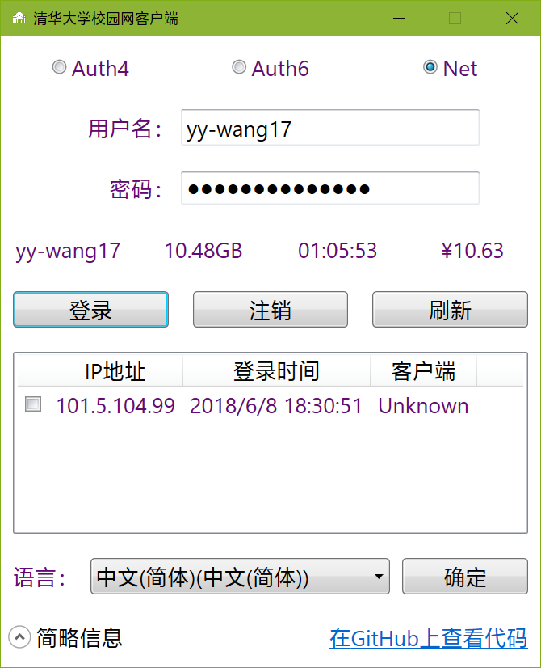

# TsinghuaNet
能快速连接清华大学校园网，包括有线网与无线网。
## 多种登录方式
支持Auth4、Auth6（未测试，不建议使用）、Net方式的登录。
## 多语言支持
默认为简体中文，所有不支持的且存在的语言会以简体中文代替；不存在的语言会以用户电脑的语言或简体中文代替。
### 支持语言列表
* en 英语
* ja 日语
* ko 朝鲜语
* ru 俄语
* vi 越南语
* zh-Hans 简体中文
* zh-Hant 繁体中文
### 多语言须知
实际上我并不会这么多语言，都是用的机器翻译。

现在已经弃疗，就这么多吧。
## 屏幕截图

## 依赖项
使用NuGet引用了我的另一个仓库[ClassLibrary](https://github.com/Berrysoft/ClassLibrary)的Berrysoft.Console与Berrysoft.Tsinghua.Net项目。
二者均使用MIT许可证。
这个仓库还有一个本程序的跨平台（控制台应用程序）版本，只支持英文。
